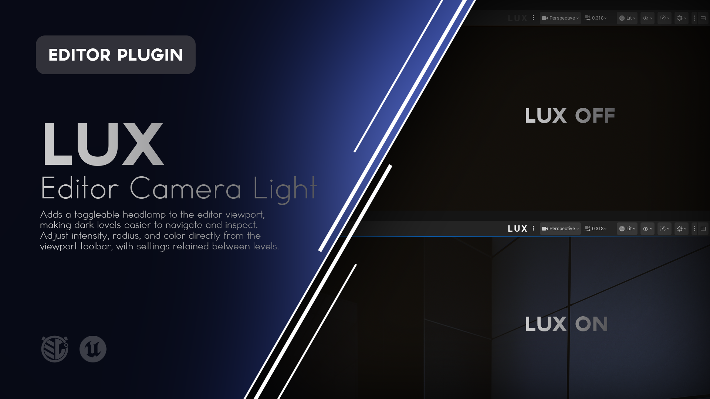
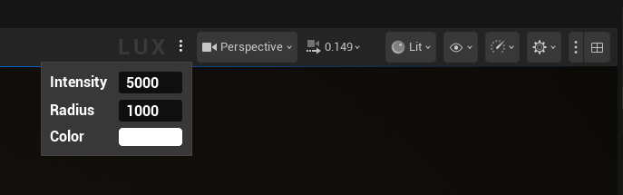
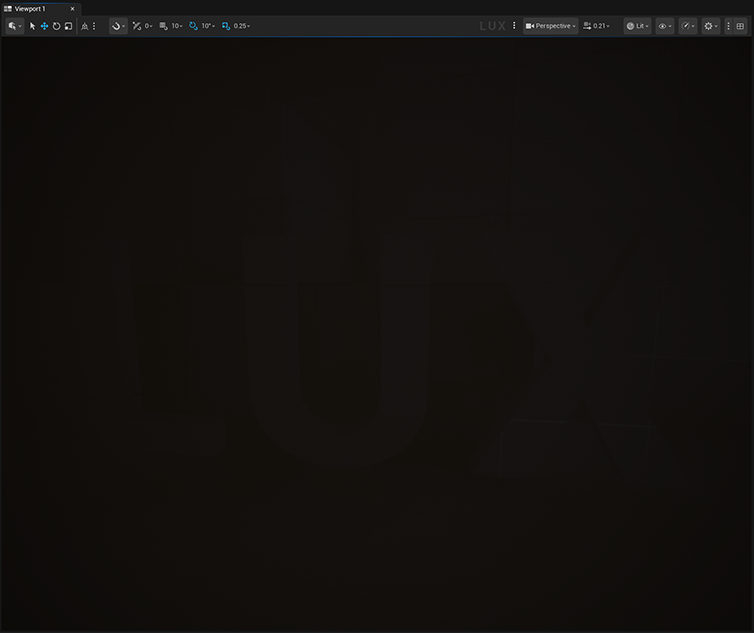
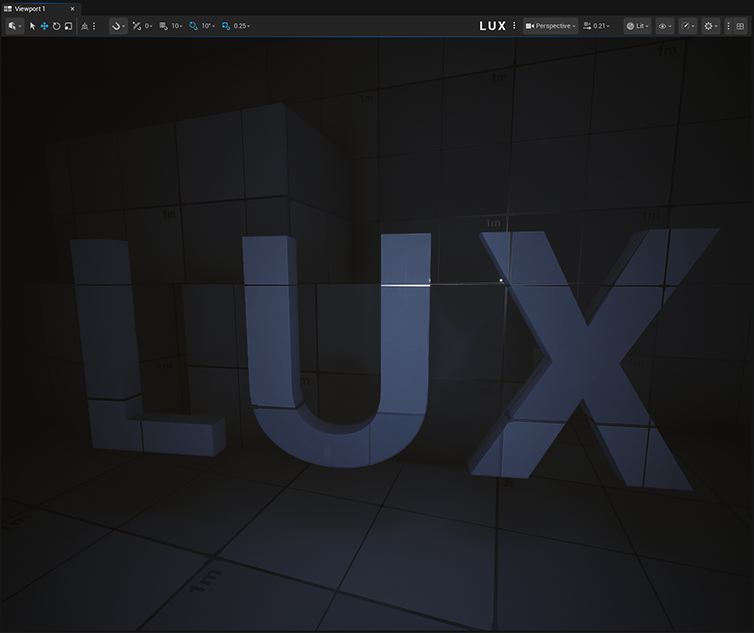

# Lux

**A simple viewport headlamp for Unreal Engine.**

Lux adds a toggleable light directly to the Unreal Editor viewport, giving you an easy way to inspect dark environments without placing temporary lights into your level.

Turn it on when you need it. Adjust the intensity, radius, and color directly from the viewport toolbar. Turn it off when you're done.




---

## What is Lux?

Building dark environments often creates a small but persistent editor problem: sometimes you need to **see the level without changing the level**.

You can increase exposure, switch view modes, place temporary lights, or otherwise modify the scene just to inspect a corner of the environment.

Lux gives you another option.

It adds a temporary headlamp to the Unreal Editor viewport that follows your camera while you work. The light exists only as an editor utility and does not require an Actor in your level.

This makes Lux particularly useful for:

* Dark horror environments
* Caves, tunnels, basements, and underground spaces
* Unlit or partially lit levels
* Lighting workflows
* Level design blockouts
* Environment art inspection
* Finding geometry hidden in darkness
* Working in intentionally low exposure environments

Lux is designed to stay out of the way until you need it.

---

# Features

### Viewport Headlamp

Enable a temporary light that follows your active editor viewport camera as you navigate the level.

No temporary light Actors. No Outliner cleanup.

### One-Click Toggle

Lux lives directly in the Level Editor viewport toolbar, allowing the headlamp to be enabled or disabled without opening another window.

### Adjustable Intensity

Increase or reduce the brightness of the headlamp to suit the environment you're inspecting.

### Adjustable Radius

Control how far the light reaches, from examining small spaces to illuminating larger environments.

### Adjustable Color

Change the headlamp color when a neutral white light is not appropriate for the environment you're working in.

### Real-Time Updates

Changes to Lux settings update the viewport immediately.

### Settings Retained Between Levels

Lux retains its current intensity, radius, color, and enabled state when moving between levels during the same Unreal Editor session.

### Editor Only

Lux exists entirely as an editor tool.

It does not add lighting to your packaged game and does not need to add Actors to your level.

### Clean Level Transitions

Lux safely releases and recreates its transient editor components when changing maps, preventing the tool from keeping unloaded editor worlds alive.

---


---

# Using Lux

Lux is intentionally simple.

## Toggle the Headlamp

Look for **Lux** in the Level Editor viewport toolbar.

Click the Lux toggle to enable the headlamp.

Click it again to disable it.

When enabled, the Lux light follows the active viewport camera as you navigate through the level.

---

## Adjust the Headlamp

Open the Lux settings menu beside the Lux toggle.

From here you can adjust:

| Setting       | Description                                    |
| ------------- | ---------------------------------------------- |
| **Intensity** | Controls the brightness of the viewport light. |
| **Radius**    | Controls how far the light reaches.            |
| **Color**     | Controls the color of the light.               |

Changes are applied immediately.



---

# Example Workflow

Imagine you're building a horror environment that is intentionally almost completely dark.

You need to inspect some geometry at the end of a hallway, but you don't want to:

* Modify your actual lighting
* Add temporary Point Lights
* Change exposure settings
* Switch to an unlit view mode
* Remember to remove temporary debugging Actors later

Instead:

1. Enable **Lux**.
2. Navigate to the area you want to inspect.
3. Adjust the intensity or radius if necessary.
4. Make your changes.
5. Disable Lux.

Your level lighting remains untouched.


| Lux Off                            | Lux On                           |
| ---------------------------------- | -------------------------------- |
|  |  |

---

# Installation

Lux can be installed through **Fab**, from a **precompiled GitHub Release**, or directly from the **GitHub source**.

For most users, the Fab or GitHub Release installation is recommended.

---

## Fab / Epic Games Launcher

> **Availability:** Use this installation method once Lux is available through Fab.

1. Add **Lux** to your library on Fab.
2. Open the **Epic Games Launcher**.
3. Navigate to your Unreal Engine Library.
4. Locate Lux in your Fab / Vault library.
5. Install Lux to the supported Unreal Engine version.
6. Launch your Unreal Engine project.
7. Open **Edit > Plugins**.
8. Search for **Lux**.
9. Enable the plugin if it is not already enabled.
10. Restart Unreal Editor if prompted.

Once enabled, Lux will appear in the Level Editor viewport toolbar.

---

## GitHub Release

This is the easiest GitHub installation method because the release package is already prepared for the supported Unreal Engine version.

### 1. Download Lux

Open the repository's **Releases** page:

https://github.com/mippi-the-dork/Lux/releases

Download the latest release package matching your Unreal Engine version and platform.

For example:

```text
Lux-v1.0.4-UE5.8.2-Win64.zip
```

### 2. Close Unreal Editor

Close the project before installing the plugin.

### 3. Locate Your Project Plugins Folder

Your project should contain a `Plugins` directory beside the `.uproject` file:

```text
YourProject/
├── Config/
├── Content/
├── Plugins/
└── YourProject.uproject
```

If the `Plugins` directory does not exist, create it.

### 4. Extract Lux

Extract the `Lux` folder into:

```text
YourProject/Plugins/
```

The final structure should look similar to:

```text
YourProject/
├── Plugins/
│   └── Lux/
│       ├── Config/
│       ├── Content/
│       ├── Resources/
│       ├── Source/
│       └── Lux.uplugin
└── YourProject.uproject
```

### 5. Launch the Project

Open your Unreal Engine project.

If necessary, navigate to:

**Edit > Plugins**

Search for:

```text
Lux
```

Enable the plugin and restart Unreal Editor if prompted.

---

## GitHub Source

Developers who want the latest source or want to modify Lux can clone the repository directly.

### Requirements

Building Lux from source requires a working Unreal Engine C++ development environment.

For Windows this generally means:

* Unreal Engine 5.8.x
* Visual Studio with the appropriate C++ workloads
* A project capable of compiling C++ plugins

### Clone the Repository

Close Unreal Editor and navigate to your project's `Plugins` directory.

```bash
cd YourProject/Plugins
git clone https://github.com/mippi-the-dork/Lux.git
```

Your project should now contain:

```text
YourProject/Plugins/Lux/
```

### Generate Project Files

If necessary:

1. Right-click your `.uproject`.
2. Select **Generate Visual Studio project files**.

Then open the generated solution and build your project's Editor target.

For example:

```text
YourProjectEditor
Win64
Development Editor
```

Launch the project after compilation completes.

---

# Updating Lux

## GitHub Release Installation

When updating a manually installed release:

1. Close Unreal Editor.
2. Remove the existing `Plugins/Lux` folder.
3. Extract the new Lux release into the `Plugins` directory.
4. Reopen the project.

Replacing the complete plugin folder is recommended rather than copying individual files over an older version.

## Git Source Installation

If you cloned the repository using Git:

```bash
cd YourProject/Plugins/Lux
git pull
```

Rebuild the project if the source has changed.

---

# Compatibility

The current Lux release targets:

|                          |                |
| ------------------------ | -------------- |
| **Lux Version**          | 1.0.4          |
| **Unreal Engine**        | 5.8.2          |
| **Platform**             | Windows 64-bit |
| **Plugin Type**          | Editor         |
| **Runtime Dependency**   | None           |
| **Packaged Game Impact** | None           |

Lux is currently configured as a **Win64 editor plugin**.

Compatibility with additional Unreal Engine versions or platforms should not be assumed unless explicitly listed in a release.

---

# How Lux Works

Lux is implemented as an Unreal Engine editor plugin using an `UEditorSubsystem` and Level Editor viewport integration.

When Lux is enabled:

1. The editor subsystem creates a transient `UPointLightComponent`.
2. The light is registered with the current Editor world.
3. Lux tracks the active Level Editor viewport.
4. The light position follows the viewport camera.
5. Changes to intensity, radius, or color are immediately applied to the transient light.
6. When Lux is disabled, the transient light component is destroyed.

Because the light is transient:

* It is not saved into the level.
* It does not appear as a normal lighting Actor in the World Outliner.
* It does not become part of the packaged game.

Lux also listens for Editor world cleanup events so that its transient light and viewport UI can be safely released during map changes.

The user's current settings remain stored by the editor subsystem and are reapplied when Lux reconstructs itself in the next Editor world.

---

# What Lux Does Not Do

Lux is an **editor visibility tool**, not a gameplay lighting system.

It does not:

* Add permanent lights to your level
* Modify existing lights
* Modify your level's saved lighting
* Affect packaged builds
* Replace Unreal's lighting workflow
* Change the appearance of the shipped game
* Create gameplay flashlight functionality

If you need an actual player flashlight or gameplay lighting system, that should be implemented as part of your game's runtime code or Blueprint systems.

Lux exists only to make working inside dark Unreal Editor environments easier.

---

# Troubleshooting

## Lux Does Not Appear in the Viewport

Check:

**Edit > Plugins**

Search for:

```text
Lux
```

Confirm that the plugin is enabled.

Restart Unreal Editor if the plugin was just enabled.

---

## Unreal Says the Plugin Was Built for a Different Engine Version

Make sure the Lux release matches the Unreal Engine version you are using.

Precompiled plugin binaries are engine-version specific.

If a compatible precompiled release is unavailable, you may need to build Lux from source for your engine version.

---

## Lux Does Not Illuminate the Environment

First confirm that Lux is enabled in the viewport toolbar.

Then try increasing:

* **Intensity**
* **Radius**

The values needed can vary substantially depending on the scale and lighting conditions of the environment.

---

## Lux Settings Reset After Restarting Unreal

Lux currently retains its state and light settings while switching between levels during the **current editor session**.

The current version does not persist those settings between separate Unreal Editor sessions.

---

# Reporting Bugs

If you encounter a problem, please open an issue:

https://github.com/mippi-the-dork/Lux/issues

When reporting a bug, include:

* Lux version
* Unreal Engine version
* Windows version
* Whether Lux was installed from Fab, a GitHub Release, or source
* Steps to reproduce the problem
* Screenshots or video when relevant
* Any relevant Unreal Editor log output

Clear reproduction steps make issues much easier to diagnose.

---

# Feature Requests

Suggestions and feature requests are welcome through GitHub Issues.

When proposing a feature, describe the workflow problem you're trying to solve rather than only the implementation you would like to see.

That makes it easier to determine whether the feature belongs in Lux and whether there may be a simpler solution.

---

# Contributions

Pull requests are welcome.

If you're considering a significant change, opening an Issue first is recommended so the direction can be discussed before substantial work is done.

Lux is intended to remain a focused editor utility, so additions should support its core purpose without turning it into a general-purpose lighting suite.

---

# License

Lux is distributed under the **MIT License**.

See [`LICENSE`](LICENSE) for details.

---

# About

Lux is an Unreal Engine editor utility created by **Mippi the Dork**.

The plugin was built around a simple workflow problem:

> Sometimes you need to see the level without changing the level.

Lux solves that problem with a light you can turn on when you need it and forget about when you don't.
